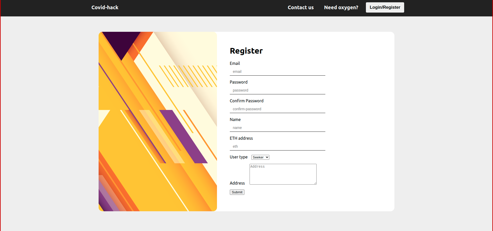

# **Covid-coin**

## **Team Members:**
- [Abishek](https://github.com/abishekarjun98)
- [Sailesh](https://github.com/0149Sailesh) 
- [Sriram](https://github.com/BLNDLYBLV)
- [Subramaniyam](https://github.com/subramaniyam73)

## **Description:**
Our application is a crowdfunding website for setting up oxygen plants. We intend to use blockchain technology to create crypto tokens (1 token = 0.001 ether) that investors can buy at any point from anywhere globally, and users would trade their coins to invest in the seeker's project seeker is a  person seeking investment). Anyone who has proper documents for building a plant can register to our site as an investment seeker, and the documents are tested with the government's database (ideally it should, but for now we don't have access to the government's license database). We created a recommendation system that uses machine learning algorithms, which helps the seekers choose the correct location for building a plant, based on current oxygen supply and demand, such that it maximizes their profits and oxygen can be distributed very efficiently.

## **Need for Covid-coin:**
- According to our research, we found that the major problem regarding the oxygen demand was poor distribution and logistics in the transportation of oxygen. 
- By using our recommendation system the time required to transport oxygen to the hospitals will be significantly reduced and thus the demand for oxygen can be met. 
- Since transactions are made with cryptocurrency(ether) anyone across the globe can contribute to the projects.
- Transactions are carried out throught blockchain so it is highly secure and transparent.

## **Idea Implementation:**
### **Website:**
We used react to render our frontend, server is scripted in nodejs to handle the API and  we use mongoDB to store all the user and project data


### **ML:**
Using The Kmeans Clustering Algorithm,the Hospitals are clustered based on their Coordinates and a Centorid is determined(where new Oxygen Plants are being suggested). This Centroid acts as a centre for Oxygen supply for multiple Hospitals.

### **Blockchain:**
A smart contract is written in Solidity language based on which transactions occur. A local test blockchain using Ganache is started, which provides 10 Ethereum wallets with 100 ethers each and the smart contract is deployed to that blockchain using truffle.
Investors are allowed to buy ethers, withdraw the invested amount(if project is not sanctioned) and ether is returned to them along with some interest amount at the end of the covid wave.





<br><br><br>  


# Covid-coin frontend
###  Web app for the frontend of Covid-coin<br><br>
# For React initialization 
## Clone the repository
```sh 
git clone https://github.com/BLNDLYBLV/Covid-hack
```

## Install the dependencies
```sh
npm install
``` 


## Running the server
- For Development
```sh
npm start 
```
- For Production
```sh 
npm run build 
```
# For Blockchain initialization
- ### Start ganache at port 7545
- ### Add and deploy the smart contract to the local blockchain by running,
```sh
truffle deploy
```
- ### Copy Token.json from build directory to public directory

